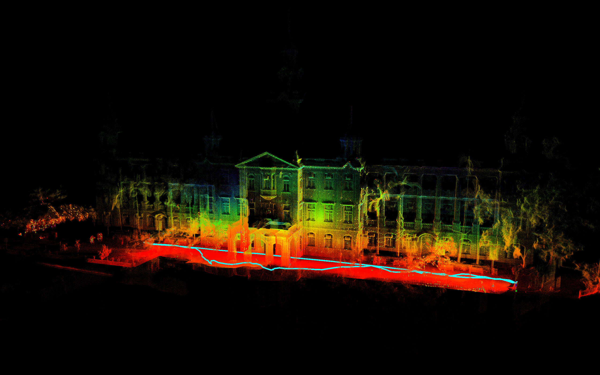

# Eq-LIO
## Equivariant Filter Implementation of S-FAST_LIO


Eq-LIO is a tightly coupled LIO framework based on the equivariant filter
and our code is implemented on [S-FAST_LIO](https://github.com/zlwang7/S-FAST_LIO).


## 1. Prerequisites
### 1.1 **Ubuntu** and **ROS**
Ubuntu >= 16.04.

### 1.2. **PCL && Eigen**
PCL >= 1.8, Eigen >= 3.3.4.

### 1.3. **livox_ros_driver**
Follow [livox_ros_driver Installation](https://github.com/Livox-SDK/livox_ros_driver).

Source：Add the line ``` source $Licox_ros_driver_dir$/devel/setup.bash ``` to the end of file ``` ~/.bashrc ```, where ``` $Licox_ros_driver_dir$ ``` is the directory of the livox ros driver workspace (should be the ``` ws_livox ``` directory if you completely followed the livox official document).

### 1.4. **Sophus**
We use the old version of Sophus
```
git clone https://github.com/strasdat/Sophus.git
cd Sophus
git checkout a621ff
mkdir build
cd build
cmake ../ -DUSE_BASIC_LOGGING=ON
make
sudo make install
```


## 2. Build Eq-LIO
Clone the repository and catkin_make:

```
cd ~/catkin_ws/src
git clone https://github.com/Eliaul/Eq-LIO.git
cd ../
catkin_make
source ~/catkin_ws/devel/setup.bash
```

## 3. Rosbag Example


<div align="left">



You can use the Avia Rosbags provided by [FAST-LIO](https://github.com/hku-mars/FAST_LIO.git).

Run:
```
roslaunch eq-lio mapping_avia.launch
rosbag play YOUR_DOWNLOADED.bag
```


## 4. Acknowledgements
Thanks for the authors of [FAST-LIO](https://github.com/hku-mars/FAST_LIO) and
[S-FAST-LIO](https://github.com/zlwang7/S-FAST_LIO).


## 5. References

[1] van Goor, Pieter, Tarek Hamel, and Robert Mahony. "Equivariant filter (eqf)." IEEE Transactions on Automatic Control (2022).

[2] Fornasier, Alessandro, et al. "Equivariant filter design for inertial navigation systems with input measurement biases." 2022 International Conference on Robotics and Automation (ICRA). IEEE, 2022.


